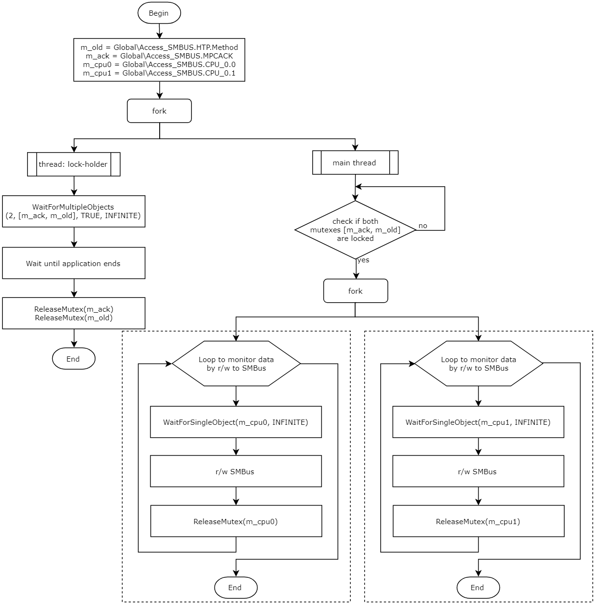

# Proposal: migrate to one mutex per SMBus controller instance approach

## Table of Contents

* [​Introduction](#introduction)
* [Problem](#problem)
* [Proposal](#proposal)
	* [Per-controller mutexes list](#percontrollermutexeslist)
	* [Aux mutexes list (needed only for migration process)](#auxmutexeslist)
* [Migration Process Overview](#migrationprocessoverview)
* [Side effect](#sideeffect)
* [Migration Process](#migrationprocess)
	* [1 Switch to new mutexes](#switchtonewmutexes)
	* [2 Lock **Global\Access_SMBUS.HTP.Method** mutex](#lockHTPMethod)
	* [3 Lock **Global\Access_SMBUS.MPCACK** mutex](#lockMPCACK)
* [Flows comparison](#flowscomparison)
	* [Before migration](#beforemigration)
	* [After migration](#aftermigration)
* [Q&A](#qa)
* [Discussion questions](#discussionquestions)

## ​Introduction
Currently there are many applications that use SMBus to control/monitor devices. Some time ago it was decided to use a shared mutex **Global\Access_SMBUS.HTP.Method** when accessing SMBus to enable simultaneous operation of several such applications.

## Problem

As time went on, systems with several SMBus controllers began to appear. And the existence of only one mutex ceased to satisfy performance requirements for applications that extensively use SMBus.  
Having one mutex for all SMBus controllers with simultaneous work of several applications or threads leads to excessive delays in data transfer, since each application/thread blocks access to all controllers at once, even if it works with only one of them at a particular time.

## Proposal
Instead of using single mutex to access all SMBus controllers it is proposed to use separate mutexes for each SMBus controller ([per-controller mutexes list](#percontrollermutexeslist) below).  

### Per-controller mutexes list
1. **Global\Access_SMBUS.CHIPSET\X**

    *Used to access Xth SMBus controller on motherboard chipset.*  
    *X is a zero-based controller index (Global\Access_SMBUS.CHIPSET\0, Global\Access_SMBUS.CHIPSET\1, etc.)*  
    **Note**: the controller index X depends on the device address in memory. The smaller index corresponds to the lower address. Most systems will only use 0 chipset index, i.e. *Global\Access_SMBUS.CHIPSET\0*

2. **Global\Access_SMBUS.CPU_N\X**

    *Used to access Xth SMBus controller on Nth CPU.*  
    *X is a zero-based controller index, N is a zero-based CPU index(Global\Access_SMBUS.CPU_0\0, Global\Access_SMBUS.CPU_0\1, Global\Access_SMBUS.CPU_1\0, Global\Access_SMBUS.CPU_1\1, etc.)*  
    **Note**: the controller index X and CPU index N depend on the device address in memory or index of PCI Bus. The smaller index corresponds to the lower memory address or PCI Bus index. Most systems will only use 0 CPU index, i.e. *Global\Access_SMBUS.CPU_0\0*, *Global\Access_SMBUS.CPU_0\1*

### Aux mutexes list (needed only for backward compatibility during migration process)
Using just per-controller mutexes will break compatibility with current applications, and to make the migration to new mutexes smoother, while retaining the possibility of simultaneous operation of several different applications (new and current), two more mutexes are needed.  
1. **Global\Access_SMBUS.MPCACK**

    *MPCACK stands for **m**utex **p**er **c**ontroller **ack**nowledgement; should be used to indicate that application uses proposed per-controller approach*

2. **Global\Access_SMBUS.HTP.Method**

    *Existing mutex. Should be used together with Global\Access_SMBUS.MPCACK for backward compatibility*

## Migration Process Overview
Making the move from existing to proposed approach is a simple process that involves the following steps:
1. Switch to new mutexes. The old mutex (**Global\Access_SMBUS.HTP.Method**) should not be used to access SMBus, and preference should be given to the new mutexes from the [list](#percontrollermutexeslist) above
2. Lock **Global\Access_SMBUS.HTP.Method** mutex for as long as upgraded application is running and using SMBus in order to support backward compatibility (also see [Side effect](#sideeffect))
3. Let other applications know that new approach is used by locking the **Global\Access_SMBUS.MPCACK** mutex for as long as upgraded application is running

## Side effect
The intention of current proposal is only to introduce per-controller mutexes, and the need to lock the old mutex for long time is unfortunate side effect.  
The result of this side effect is that old applications will not be able to continue working alongside new applications without switching to new mutexes.

## Migration Process
### 1 Switch to new mutexes
This step is pretty straightforward. Wherever **Global\Access_SMBUS.HTP.Method** mutex is used it should be **replaced** with one (or several) of new mutexes. If it is necessary to access several SMBus controllers, the logic should be separated so that only one of the mutexes is blocked at a time. When significant part of applications migrate to new mutexes, making this step is sufficient and does not require any other steps. But, to guarantee stable work of application with those that did not migrate, two more steps needed as follows.

### 2 Lock **Global\Access_SMBUS.HTP.Method** mutex
At this step it is needed to lock old mutex and release it only when application ends.  
Old applications that use this mutex will no longer work with SMBus without migrating to new mutexes, but it is also guaranteed that they will not impact on any new application.  
It may happen that at the time of application "A" launching another application "B" will already be launched that has already locked this mutex (which means the Global\Access_SMBUS.MPCACK mutex will also be locked in the system, and this can be checked). In this case, the access to SMBus will be performed correctly, but it will not be possible to lock the mutex on the first attempt - it is necessary to perform repeated attempts until application "B" releases the mutex or application "A" completes its work. Note, that it is required to have dedicated thread to hold a lock of this mutex.

### 3 Lock **Global\Access_SMBUS.MPCACK** mutex
At this step it is needed to lock acknowledgement mutex and release it only when application ends. This will inform other applications that mutex-per-controller approach is used. Locking should be performed right after the old mutex locked. It can be done in the same thread.

## Flows comparison

### Before migration

### After migration (including backward compatibility)

Using "*Global\Access_SMBUS.CHIPSET\0*" mutex:

Using "*Global\Access_SMBUS.CPU_0\0*" and "*Global\Access_SMBUS.CPU_0\1*" mutexes:

### After migration (excluding backward compatibility)

Using "*Global\Access_SMBUS.CPU_0\0*" and "*Global\Access_SMBUS.CPU_0\1*" mutexes:

## Q&A

1. Q: Why don't just keep the old mutex around new mutexes?  
A: Because sync between threads causes ~16ms delays that ruin the whole purpose of introducing new mutexes

## Discussion questions

1. Is there any better approach?
2. What does *HTP.Method* mean and can we omit it from naming?
3. Do any other SMBus controllers need to be considered and individual mutexes created for them?